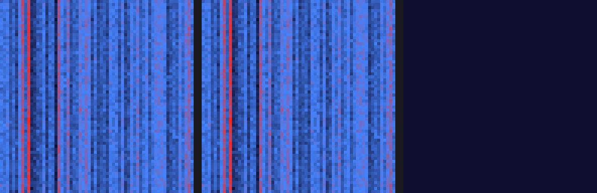

# kernel-bridge

**CUDA → ROCm 커널 레벨 변환 데모** — 무료 변환 도구가 어디까지 해주고,
어디서부터 **정답 대조 없이는 발견조차 안 되는지**를 실측한다.

> 주장이 아니라 로그다. 이 저장소의 숫자는 전부 실행 결과에서 나왔고,
> 실측값이 없는 칸은 비워 두었다.

---

## 결과 한 줄

NVIDIA 전용 CUDA 커널 **15개 (3파일 / 2,294줄)** → AMD MI300X.
**양 플랫폼 모두 15/15 PASS**, 두 GPU 출력의 최대 상대오차 **3.783e-07**.

그 사이 **이슈 19건**. 그중 **16건은 컴파일러·런타임이 알려줬고, 3건은 아무도 알려주지 않았다.**

| 구분 | 건수 | 무엇이 알려주는가 |
|---|---|---|
| hipify 자동 치환 | **164줄** | 도구 |
| 컴파일 에러 | **15** | 컴파일러 |
| 런타임 에러 코드 | **1** | hipBLAS 반환값 |
| **★ 아무도 알려주지 않음** | **3** | **정답 대조만** |

**19건 전부 LLM 이 고쳤다.** 사람이 손으로 고쳐야 하는 건 없었다.
문제는 난이도가 아니라 **루프에 신호가 있는지**다 — 신호가 없는 3건에서 자동화가 멈춘다.

---

## Phase 별 실측

### Phase 1 — NVIDIA 기준선 (완료)

GTX 970 (sm_52) · WSL2 + CUDA 12.6 · fp32 · B=2

| 대상 | 커널 | 정확도 |
|---|---|---|
| softmax_forward | 8 | **8/8 PASS** |
| attention_forward | 6 | **6/6 PASS** |
| flash_attention (자체) | 1 | **PASS** (상대오차 1.721e-06) |

→ [01-baseline/baseline.md](01-baseline/baseline.md)

### Phase 2 — 변환 (완료)

**GPU 없이** gfx942 로 컴파일 성공. hipify 자동 164줄 + 컴파일 이슈 11건 해결.

측정 방법: hipify 원본 출력을 먼저 커밋해 두고, 이후 `02-convert/hipify-out/` 의
git diff 를 "사람이 한 일"로 셌다. → [logs/time-log.md](logs/time-log.md)

### Phase 3 — MI300X 검증 (완료)

AMD Instinct MI300X VF · gfx942 · **ROCm 7.0.2** · fp32 · B=2

| 대상 | 커널 | 정확도 |
|---|---|---|
| softmax_forward | 8 | **8/8 PASS** |
| attention_forward | 6 | **6/6 PASS** |
| flash_attention (자체) | 1 | **PASS** (상대오차 1.815e-06) |

**컴파일이 통과했다는 것이 동작을 뜻하지 않았다** — 여기서 이슈 8건이 더 나왔다.
세션을 두 번 돌려 같은 값이 재현되는 것도 확인했다.

→ [03-verify/verify.md](03-verify/verify.md)

---

## ★ 신호가 없어서 자동화가 멈추는 3건

이 목록이 이 프로젝트의 핵심이다. **컴파일 통과 · 크래시 없음 · 답만 틀림.**
재컴파일해도 아무 변화가 없으므로 **LLM 이 "고쳤는지"를 판단할 근거가 없다.**

**1. 호스트 `max(float, float)` 가 `int max(int, int)` 로 해석된다**
```c
max_el = max(max_el, out[i]);      // 호스트 코드
```
HIP 호스트에는 float 오버로드가 보이지 않는다. float 가 int 로 변환되고 `-inf` 는 UB 라
쓰레기값(905987520)이 나온다. CUDA 는 호스트에도 오버로드가 있어 **원본은 정상이다.**
경고 한 줄만 나오고, **원본에 우연히 있던 `assert` 가 유일한 방어선이었다.**

**2·3. 커널 8 — 웨이브 폭 가정이 디바이스·호스트 양쪽에 있다**
```c
const int warpsPerBlock = blockDim.x / warpSize;    // NVIDIA 32/32=1 · AMD 32/64=0
const int grid_size = ceil_div(N * 32, block_size); // "행 하나당 32스레드" 전제
```
NVIDIA 는 한 조가 32명, AMD 는 64명이다. **둘 중 하나만 고치면 여전히 틀린다.**

### 일괄 치환이 불가능한 이유 — 가장 명확한 증거

같은 파일, **글자까지 동일한 두 줄**인데 한쪽은 맞고 한쪽은 틀리다.

```c
void softmax_forward_online2(...) {                      // 커널 6
    const int grid_size = ceil_div(N * 32, block_size);  // ✅ 옳다
}   // 커널 안: cg::tiled_partition<32>  ← 32레인 타일을 명시

void softmax_forward_online8(...) {                      // 커널 8
    const int grid_size = ceil_div(N * 32, block_size);  // ❌ 64 여야 한다
}   // 커널 안: blockDim.x / warpSize   ← 런타임 값 사용
```

어느 쪽이 틀렸는지는 **각 커널이 스레드를 어떻게 배치하는지 읽어야만** 알 수 있다.
`sed` 로 일괄 처리하면 **맞는 쪽을 망가뜨린다.**

### 부수 발견 — "AMD 버전 간" 이식이 또 있다

ROCm 6.3 에서 되던 것이 7.0.2 에서 4건 깨졌다. 6.3 에 없어서 우리가 채운 `__syncwarp` 가
7.x 에서는 **중복 정의**가 됐고, 반대로 있던 API 하나(`..._v2`)는 **제거**됐다. 방향이 양쪽이다.
고객 입장에서는 **ROCm 을 올릴 때마다 다시 깨진다**는 뜻이다.

---

## "같은 답이 나온다"를 눈으로 확인하기

같은 입력을 두 GPU 에 넣고 출력을 그림으로 그린다.
왼쪽·가운데가 각 GPU 의 출력, **오른쪽이 차이**다.

**실측 — NVIDIA GTX 970 vs AMD MI300X · 차이 패널이 완전한 검정**



```
최대 절대오차 : 2.980e-08
최대 상대오차 : 3.783e-07
```

**커널에 버그를 주입한 경우 — 차이 패널에 불이 들어온다**


차이 패널의 색 기준은 **허용오차**다 (검정=일치 · 파랑=허용 이내 · 빨강=허용 초과).
버그 버전은 online softmax 의 재조정 계수를 제거한 **진짜로 잘못된 커널**이다
(조작된 데이터가 아니다). 입력은 결정적 난수(xorshift32)로 두 플랫폼에서 비트 단위 동일하다.

```bash
bash scripts/41_dump_reference.sh nvidia_970 1024        # NVIDIA 에서 덤프
BREAK=1 bash scripts/41_dump_reference.sh broken_demo 1024  # 버그 주입 버전
python3 scripts/40_demo_images.py a.bin b.bin --labels NVIDIA MI300X
```

---

## 변환 대상 (3파일 고정)

변환 순서는 **어려운 것부터**다. 쉬운 파일을 먼저 하면 자동화율이 과대평가된다.

1. llm.c `dev/cuda/softmax_forward.cu` (732줄) — warp32 가정이 가장 많음
2. llm.c `dev/cuda/attention_forward.cu` (1390줄) — cuBLAS/cuBLASLt + `cg::reduce`
3. `00-src/flash_attention_simplified.cu` (172줄) — 자체 교육용 커널

근거와 확정 범위: [02-convert/scope.md](02-convert/scope.md)

## 실행 순서 — 과금 경계가 핵심

| Phase | 스크립트 | GPU | 비용 |
|---|---|---|---|
| 0 | `00_fetch_sources.sh` | 없음 | $0 |
| 1 | `10_baseline_nvidia.sh` | NVIDIA | $0 (로컬 GTX 970) |
| 2a | `20_hipify.sh` | **없음** | $0 |
| 2b | `21_build_hip.sh` | **없음** | $0 |
| 3 | `50_pod_session.sh` | MI300X | $1.99/시간 |

**hipify 와 hipcc 컴파일에는 GPU 가 필요 없다.** 가장 오래 걸리는 컴파일 수정 루프를
CPU 컨테이너에서 끝내고 MI300X 는 "실행" 단계에서만 켠다.
실제로 MI300X 세션은 **한 번에 약 30~40분**으로 끝났다.

셋업·재현 절차와 **실측으로 겪은 함정 14건**: [RUNBOOK.md](RUNBOOK.md)

## 폴더 구조

```
00-src/       자체 소스 (교육용 커널 · 검증 하네스 · 덤프 도구)
docker/       Phase 2 빌드 환경 (ROCm 6.3 기반)
scripts/      단계별 실행 스크립트
01-baseline/  NVIDIA 실측 결과
02-convert/   변환 범위 · hipify 출력 · 수정 diff · 에러 로그
03-verify/    MI300X 검증 결과
logs/         시간·이슈 기록 (지표의 원료)
report/       요약 · 데모 설계 · 녹화 대본 · 발표자 가이드 · 데모 이미지
```

## 발표·데모 문서

| 문서 | 누가 읽나 |
|---|---|
| [report/presenter-guide.md](report/presenter-guide.md) | **발표자** — 이거 하나만 읽으면 발표할 수 있다 |
| [report/recording-script.md](report/recording-script.md) | 촬영하는 사람 — 찍는 순서와 명령 |
| [report/demo-plan.md](report/demo-plan.md) | 설계 근거 |
| [report/summary.md](report/summary.md) | 숫자의 출처 |

## 원칙

- 모든 에러·소요 시간을 `logs/` 에 기록한다 — **로그가 곧 산출물이다**
- 커뮤니티 ROCm 포크는 먼저 보지 않는다. 막혔을 때만 참조하고 그 사실을 기록한다
- **실측값 없는 숫자는 보고서에 쓰지 않는다**
- **성능 비교는 이 프로젝트의 범위가 아니다.** 기준선이 GTX 970(2014)이므로
  MI300X 와의 시간 차이는 이식 품질이 아니라 하드웨어 세대 차이다.
  측정값은 `03-verify/comparison.md` 에 참고용으로만 남기고 발표하지 않는다
