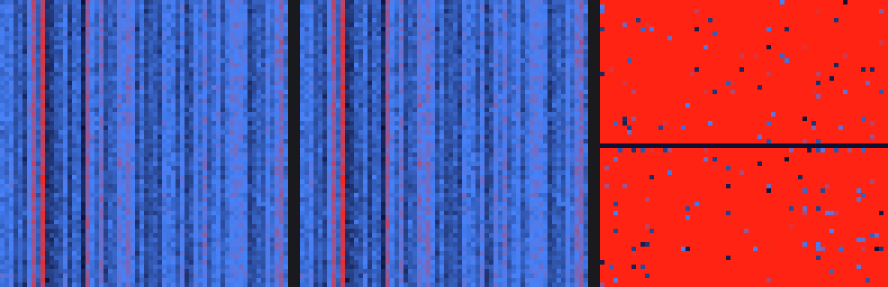

# kernel-bridge

**CUDA → ROCm 커널 레벨 변환 데모** — HIPIFY 가 어디까지 자동으로 해주고,
어디서부터 사람이 필요한지를 **실측**한다.

> 주장이 아니라 로그다. 이 저장소의 숫자는 전부 실행 결과에서 나왔고,
> 실측값이 없는 칸은 비워 두었다.

---

## 지금까지의 결과

### Phase 2 — 변환 (완료)

NVIDIA 전용 커널 3파일(2,294줄)을 AMD MI300X(gfx942)용으로 **GPU 없이 컴파일 성공**.

| 항목 | 값 |
|---|---|
| hipify 자동 변환 | **164줄** |
| 컴파일 에러 | **11건** (5회차에 전부 해결) |
| ├ LLM 보조로 해결 | 7건 |
| ├ **사람 판단 필요** | **3건** ← 여기가 자동화의 한계 |
| └ 환경 문제 | 1건 |
| 사람이 쓴 코드 | 변환물 51줄 수정 + 호환 계층 134줄 |

측정 방법: hipify 원본 출력을 먼저 커밋해 두고, 이후 `02-convert/hipify-out/` 의
git diff 를 "사람이 한 일"로 셌다. → [logs/time-log.md](logs/time-log.md)

### Phase 1 — NVIDIA 기준선 (완료)

| 대상 | 커널 | 정확도 |
|---|---|---|
| softmax_forward | 8 | **8/8 PASS** |
| attention_forward | 6 | **6/6 PASS** |
| flash_attention (자체) | 1 | **PASS** (상대오차 1.7e-06) |

→ [01-baseline/baseline.md](01-baseline/baseline.md)

### Phase 3 — MI300X 검증 (예정)

---

## 자동 변환으로 도달할 수 없었던 3건

이 목록이 이 프로젝트의 핵심이다. **문법 치환으로는 해결되지 않는다.**

**1. `cg::reduce` 가 HIP 에 아예 없다**
ROCm 6.3 의 `hip_cooperative_groups.h` 에 `reduce` 심볼이 0건이다. shuffle 로 재구성해야 하는데,
`__shfl` 은 스칼라만 받으므로 구조체는 word 단위로 쪼개야 하고, `cg::reduce` 는 **모든 레인**에
결과를 남기므로 마지막 브로드캐스트가 필요하다. **빠뜨리면 컴파일도 되고 크래시도 안 나면서 답만 틀린다.**

**2. `__shfl_*_sync` 의 폭을 사람이 정해야 한다**
hipify 는 이 8곳을 **전혀 변환하지 않는다.** CUDA 는 워프 폭이 32 로 암묵 고정이지만 AMD 는 웨이브가 64다.
그리고 **같은 파일 안에서 관례가 갈린다** — `warpReduceMax` 는 `offset=16`(32 가정),
`kernel8` 은 `offset=warpSize/2`(런타임 64). 일괄 치환하면 반드시 틀린다.

**3. `#if` 안에 숨은 정의는 도구가 못 본다**
`#if defined(ENABLE_BF16) && (__CUDACC_VER_MAJOR__ < 12) && ...` 로 감싼 bf16 용 `__ldcs`/`__stcs` 가
HIP 에서 조건이 항상 거짓이 되어 **통째로 사라진다.** hipify 는 전처리기 조건 내부를 해석하지 않고,
에러는 한참 뒤 **사용 지점**에서 엉뚱한 모습으로 나타난다.

---

## "같은 답이 나온다"를 눈으로 확인하기

같은 입력을 두 GPU 에 넣고 출력을 그림으로 그린다.
왼쪽·가운데가 각 GPU 의 출력, **오른쪽이 차이**다.

**정상 — 차이 패널이 완전한 검정**


**커널에 버그를 주입한 경우 — 차이 패널에 불이 들어온다**



차이 패널의 색 기준은 **허용오차**다 (검정=일치 · 파랑=허용 이내 · 빨강=허용 초과).
위 두 장은 실제로 GTX 970 에서 컴파일해 돌린 결과이며, 아래 버그 버전은
online softmax 의 재조정 계수를 제거한 **진짜로 잘못된 커널**이다 (조작된 데이터가 아니다).

```bash
bash scripts/41_dump_reference.sh nvidia          # NVIDIA 에서 덤프
BREAK=1 bash scripts/41_dump_reference.sh broken  # 버그 주입 버전
python3 scripts/40_demo_images.py a.bin b.bin     # 열지도 3장 생성
```

---

## 변환 대상 (3파일 고정)

변환 순서는 **어려운 것부터**다. 쉬운 파일을 먼저 하면 자동화율이 과대평가된다.

1. llm.c `dev/cuda/softmax_forward.cu` (732줄) — warp32 가정이 가장 많음
2. llm.c `dev/cuda/attention_forward.cu` (1390줄) — cuBLAS/cuBLASLt + `cg::reduce`
3. `00-src/flash_attention_simplified.cu` (172줄) — 자체 교육용 커널

근거와 확정 범위: [02-convert/scope.md](02-convert/scope.md)

## 실행 순서 — 과금 경계가 핵심

| Phase | 스크립트 | GPU | 비용 |
|---|---|---|---|
| 0 | `00_fetch_sources.sh` | 없음 | $0 |
| 1 | `10_baseline_nvidia.sh` | NVIDIA | ~$5 |
| 2a | `20_hipify.sh` | **없음** | $0 |
| 2b | `21_build_hip.sh` | **없음** | $0 |
| 3 | `30_verify_mi300x.sh` | MI300X | ~$10 |

**hipify 와 hipcc 컴파일에는 GPU 가 필요 없다.** 가장 오래 걸리는 컴파일 수정 루프를
CPU 컨테이너에서 끝내고 MI300X 는 "실행" 단계에서만 켠다 → MI300X 6~10h 를 2~3h 로 줄인다.

셋업·재현 절차와 **실측으로 겪은 함정 9건**: [RUNBOOK.md](RUNBOOK.md)

## 폴더 구조

```
00-src/       자체 소스 (교육용 커널 · 검증 하네스 · 덤프 도구)
docker/       Phase 2 빌드 환경 (ROCm 6.3 기반)
scripts/      단계별 실행 스크립트
01-baseline/  NVIDIA 실측 결과
02-convert/   변환 범위 · hipify 출력 · 수정 diff · 에러 로그
03-verify/    MI300X 검증 결과
logs/         시간·이슈 기록 (지표의 원료)
report/       요약 · 데모 설계 · 데모 이미지
```

## 원칙

- 모든 에러·소요 시간을 `logs/` 에 기록한다 — **로그가 곧 산출물이다**
- 커뮤니티 ROCm 포크는 먼저 보지 않는다. 막혔을 때만 참조하고 그 사실을 기록한다
- **실측값 없는 숫자는 보고서에 쓰지 않는다**
- **정밀도·문제 크기를 맞추지 않은 성능 비교는 하지 않는다**
- 세대가 다른 GPU 의 성능 격차를 이식 품질로 발표하지 않는다
